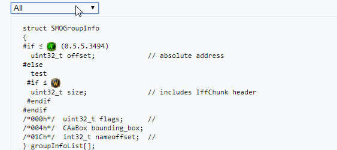

# Wiki Build Filter Extension
An extension for the wowdev wiki to allow the filtering of pre based code blocks by client build.

##### Example:

---
```wiki
<conditional>
 struct SMOGroupInfo 
 {
 {{Template:Condition|condition=if|max_expansionlevel=0|max_build=0.5.5.3494}} 
   uint32_t offset;             // absolute address
 {{Template:Condition|condition=else}} 
   test
  {{Template:Condition|condition=if|max_expansionlevel=1}} 
   uint32_t size;               // includes IffChunk header
  {{Template:Condition|condition=endif}} 
 {{Template:Condition|condition=endif}} 
 /*000h*/  uint32_t flags;      //  
 /*004h*/  {{Template:Type|CAaBox}} bounding_box;
 /*01Ch*/  int32_t nameoffset;  // 
 } groupInfoList[];
</conditional>
```
##### Notes:
- Supports nested conditions
- Uses a custom "condition" template (found in `_templates`) that wraps VersionRange
- Doesn't support exclusive build numbers
